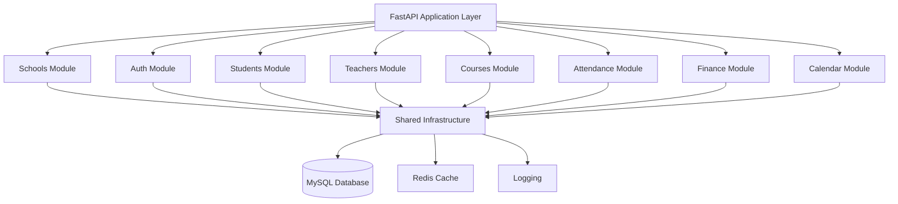

# Multi-School ERP - Modular Monolith Architecture

Implementing a comprehensive multi-school ERP system following Modular Monolith principles with FastAPI, SQLAlchemy 2.0, and MySQL.

## Architecture Overview



## Proposed Changes

### Project Structure

```
mindwhile-erp-fastapi/
├── alembic/                      # Database migrations
├── app/
│   ├── __init__.py
│   ├── main.py                   # Application entry point
│   ├── config.py                 # Configuration management
│   ├── database.py               # Database setup
│   │
│   ├── core/                     # Shared infrastructure
│   │   ├── __init__.py
│   │   ├── dependencies.py       # Common dependencies
│   │   ├── security.py           # Auth utilities
│   │   ├── exceptions.py         # Custom exceptions
│   │   └── middleware.py         # Custom middleware
│   │
│   ├── modules/
│   │   ├── __init__.py
│   │   │
│   │   ├── schools/              # Schools module (multi-tenancy)
│   │   │   ├── __init__.py
│   │   │   ├── models.py
│   │   │   ├── schemas.py
│   │   │   ├── repository.py
│   │   │   ├── service.py
│   │   │   └── router.py
│   │   │
│   │   ├── auth/                 # Authentication & Users
│   │   │   ├── __init__.py
│   │   │   ├── models.py
│   │   │   ├── schemas.py
│   │   │   ├── repository.py
│   │   │   ├── service.py
│   │   │   └── router.py
│   │   │
│   │   ├── students/
│   │   │   ├── __init__.py
│   │   │   ├── models.py
│   │   │   ├── schemas.py
│   │   │   ├── repository.py
│   │   │   ├── service.py
│   │   │   └── router.py
│   │   │
│   │   ├── teachers/
│   │   │   ├── __init__.py
│   │   │   ├── models.py
│   │   │   ├── schemas.py
│   │   │   ├── repository.py
│   │   │   ├── service.py
│   │   │   └── router.py
│   │   │
│   │   ├── courses/
│   │   │   ├── __init__.py
│   │   │   ├── models.py
│   │   │   ├── schemas.py
│   │   │   ├── repository.py
│   │   │   ├── service.py
│   │   │   └── router.py
│   │   │
│   │   ├── attendance/
│   │   │   ├── __init__.py
│   │   │   ├── models.py
│   │   │   ├── schemas.py
│   │   │   ├── repository.py
│   │   │   ├── service.py
│   │   │   └── router.py
│   │   │
│   │   ├── finance/
│   │   │   ├── __init__.py
│   │   │   ├── models.py
│   │   │   ├── schemas.py
│   │   │   ├── repository.py
│   │   │   ├── service.py
│   │   │   └── router.py
│   │   │
│   │   └── calendar/
│   │       ├── __init__.py
│   │       ├── models.py
│   │       ├── schemas.py
│   │       ├── repository.py
│   │       ├── service.py
│   │       └── router.py
│   │
│   └── shared/                   # Shared models & utilities
│       ├── __init__.py
│       ├── base_models.py        # Base SQLAlchemy models
│       ├── enums.py              # Shared enumerations
│       └── utils.py              # Utility functions
│
├── tests/                        # Test suite
├── alembic.ini                   # Alembic configuration
├── requirements.txt
├── .env
└── README.md
```

### Core Components

#### Infrastructure Layer

##### [MODIFY] [database.py](file:///Users/venkatreddy/Desktop/MindwhileERP/mindwhile-erp-fastapi/app/database.py)
Update to use provided MySQL credentials and support for async operations.

##### [NEW] [config.py](file:///Users/venkatreddy/Desktop/MindwhileERP/mindwhile-erp-fastapi/app/config.py)
Centralized configuration using Pydantic settings.

##### [NEW] [core/security.py](file:///Users/venkatreddy/Desktop/MindwhileERP/mindwhile-erp-fastapi/app/core/security.py)
JWT authentication, password hashing, and security utilities.

##### [NEW] [core/dependencies.py](file:///Users/venkatreddy/Desktop/MindwhileERP/mindwhile-erp-fastapi/app/core/dependencies.py)
Common FastAPI dependencies (auth, pagination, school context).

---

#### Module Layer

Each module follows the same pattern:
- **models.py**: SQLAlchemy models
- **schemas.py**: Pydantic request/response models
- **repository.py**: Data access layer (CRUD operations)
- **service.py**: Business logic layer
- **router.py**: FastAPI routes

##### [NEW] Schools Module
Foundation for multi-tenancy support. Each school operates independently with shared infrastructure.

##### [NEW] Auth Module
User authentication, role-based access control (Super Admin, School Admin, Teacher, Student).

##### [NEW] Students Module
Student profiles, enrollment, academic records.

##### [NEW] Teachers Module
Teacher profiles, assignments, qualifications.

##### [NEW] Courses Module
Subject management, class sections, schedules.

##### [NEW] Attendance Module
Daily attendance tracking for students and teachers.

##### [NEW] Finance Module
Fee structure, payments, invoices, financial reports.

##### [NEW] Calendar Module
Academic calendar, holidays, events, exam schedules.

---

### Database Design

Key relationships:
- Schools are the top-level entity (multi-tenancy)
- Users belong to schools with specific roles
- Students, Teachers, Courses are scoped to schools
- Attendance and Finance records link to students/teachers within schools

### Verification Plan

#### Automated Tests
- Run Alembic migrations
- Verify database tables are created
- Test CRUD operations for each module

#### Manual Verification
- Start the application
- Access `/docs` to verify API documentation
- Test authentication flow
- Create sample school and users
- Verify multi-tenancy isolation
