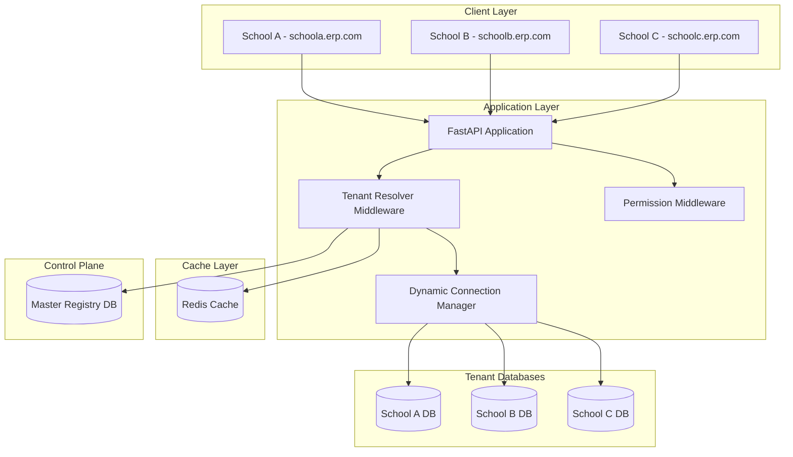

# Multi-Tenant ERP with Database-per-School Isolation

**Enterprise-grade Multi-School ERP with Physical Database Isolation, Master Control Plane, Dynamic Tenant Resolution, and Granular RBAC**

## Architecture Overview



## Core Technical Requirements

### Technology Stack
- **FastAPI**: Async framework
- **SQLAlchemy 2.0**: Async ORM with type hints
- **MySQL 8.0**: Physical database per school
- **Alembic**: Multi-database migrations
- **Redis**: Tenant metadata caching
- **PyJWT**: Authentication tokens
- **asyncpg/aiomysql**: Async database drivers

### Multi-Tenancy Strategy
**Database-per-School Isolation**
- Each school has a physically separate MySQL database
- Master Registry DB maps tenants to connection strings
- Complete data isolation at database level
- Independent scaling per school

## User Review Required

> [!IMPORTANT]
> **Breaking Changes**
> - Complete architectural refactoring required
> - Migration from shared DB to isolated DBs
> - All existing data will need migration
> - API contracts remain compatible but internals change significantly

> [!WARNING]
> **Infrastructure Requirements**
> - Redis server required for tenant caching
> - Multiple MySQL databases (1 master + N schools)
> - Increased database connections and memory
> - Network latency considerations for dynamic resolution

## Proposed Changes

### Project Structure

```
mindwhile-erp-fastapi/
├── app/
│   ├── __init__.py
│   ├── main.py                          # Application entry
│   ├── config.py                        # Updated config
│   │
│   ├── core/                            # Core infrastructure
│   │   ├── __init__.py
│   │   ├── security.py                  # JWT & password hashing
│   │   ├── exceptions.py                # Custom exceptions
│   │   ├── dependencies.py              # Common dependencies
│   │   └── permissions.py               # [NEW] Permission system
│   │
│   ├── tenancy/                         # [NEW] Multi-tenancy engine
│   │   ├── __init__.py
│   │   ├── models.py                    # Master DB models
│   │   ├── schemas.py                   # Tenant schemas
│   │   ├── resolver.py                  # Tenant resolution logic
│   │   ├── manager.py                   # Connection manager
│   │   ├── middleware.py                # Tenant middleware
│   │   ├── database.py                  # Multi-DB session handling
│   │   ├── cache.py                     # Redis tenant cache
│   │   └── provisioner.py               # New tenant DB creation
│   │
│   ├── rbac/                            # [NEW] RBAC system
│   │   ├── __init__.py
│   │   ├── models.py                    # Roles & permissions
│   │   ├── schemas.py                   # Permission schemas
│   │   ├── decorators.py                # Permission decorators
│   │   ├── engine.py                    # Permission evaluation
│   │   └── constants.py                 # Permission definitions
│   │
│   ├── modules/                         # Business modules
│   │   ├── __init__.py
│   │   │
│   │   ├── academics/                   # [REFACTORED] Academic module
│   │   │   ├── __init__.py
│   │   │   ├── students/
│   │   │   ├── teachers/
│   │   │   ├── courses/
│   │   │   ├── attendance/
│   │   │   └── grades/
│   │   │
│   │   ├── finance/                     # [NEW] Finance module
│   │   │   ├── __init__.py
│   │   │   ├── fees/
│   │   │   ├── payments/
│   │   │   └── invoices/
│   │   │
│   │   ├── administration/              # [NEW] Admin module
│   │   │   ├── __init__.py
│   │   │   ├── schools/
│   │   │   ├── users/
│   │   │   └── settings/
│   │   │
│   │   └── communication/               # [NEW] Communication
│   │       ├── __init__.py
│   │       ├── notifications/
│   │       └── messaging/
│   │
│   └── shared/                          # Shared utilities
│       ├── __init__.py
│       ├── base_models.py               # Base models
│       ├── enums.py                     # Enumerations
│       └── utils.py                     # Utilities
│
├── alembic/                             # Migrations
│   ├── master/                          # [NEW] Master DB migrations
│   │   ├── env.py
│   │   └── versions/
│   ├── tenant/                          # [NEW] Tenant DB migrations
│   │   ├── env.py
│   │   └── versions/
│   └── multi_migrate.py                 # [NEW] Parallel migrator
│
├── scripts/                             # [NEW] Management scripts
│   ├── provision_tenant.py              # Create new school DB
│   ├── migrate_all_tenants.py           # Mass migration
│   └── backup_tenant.py                 # Backup utilities
│
├── requirements.txt
├── .env
├── alembic.ini
└── README.md
```

---

## Component Details

### 1. Master Registry Database

#### [NEW] Master DB Schema (`master_registry` database)

```sql
-- Tenant/School registry
CREATE TABLE schools (
    id INT AUTO_INCREMENT PRIMARY KEY,
    subdomain VARCHAR(100) UNIQUE NOT NULL,
    name VARCHAR(200) NOT NULL,
    db_host VARCHAR(255) NOT NULL DEFAULT 'localhost',
    db_port INT NOT NULL DEFAULT 3306,
    db_name VARCHAR(100) NOT NULL,
    db_user VARCHAR(100) NOT NULL,
    db_password_encrypted VARCHAR(500) NOT NULL,
    is_active BOOLEAN DEFAULT TRUE,
    max_students INT,
    max_teachers INT,
    subscription_tier VARCHAR(50),
    created_at TIMESTAMP DEFAULT CURRENT_TIMESTAMP,
    updated_at TIMESTAMP DEFAULT CURRENT_TIMESTAMP ON UPDATE CURRENT_TIMESTAMP,
    INDEX idx_subdomain (subdomain),
    INDEX idx_active (is_active)
);

-- Global super admins (cross-tenant)
CREATE TABLE super_admins (
    id INT AUTO_INCREMENT PRIMARY KEY,
    email VARCHAR(100) UNIQUE NOT NULL,
    username VARCHAR(50) UNIQUE NOT NULL,
    hashed_password VARCHAR(255) NOT NULL,
    full_name VARCHAR(100),
    is_active BOOLEAN DEFAULT TRUE,
    created_at TIMESTAMP DEFAULT CURRENT_TIMESTAMP
);

-- Permission definitions (global)
CREATE TABLE permissions (
    id INT AUTO_INCREMENT PRIMARY KEY,
    code VARCHAR(100) UNIQUE NOT NULL,
    module VARCHAR(50) NOT NULL,
    resource VARCHAR(50) NOT NULL,
    action VARCHAR(20) NOT NULL,
    description TEXT,
    UNIQUE KEY unique_permission (module, resource, action)
);

-- Role templates
CREATE TABLE role_templates (
    id INT AUTO_INCREMENT PRIMARY KEY,
    name VARCHAR(50) NOT NULL,
    description TEXT,
    is_system BOOLEAN DEFAULT FALSE
);

-- Role-Permission mappings
CREATE TABLE role_permissions (
    role_id INT,
    permission_id INT,
    PRIMARY KEY (role_id, permission_id),
    FOREIGN KEY (role_id) REFERENCES role_templates(id),
    FOREIGN KEY (permission_id) REFERENCES permissions(id)
);
```

---

### 2. Tenancy Logic Implementation

#### [NEW] `app/tenancy/resolver.py` - Tenant Resolution

```python
from typing import Optional
from fastapi import Request, HTTPException
from app.tenancy.cache import TenantCache
from app.tenancy.models import School

class TenantResolver:
    """Resolves tenant from request context"""
    
    def __init__(self, cache: TenantCache):
        self.cache = cache
    
    async def resolve_from_subdomain(self, request: Request) -> Optional[School]:
        """Extract tenant from subdomain"""
        host = request.headers.get("host", "")
        subdomain = host.split(".")[0] if "." in host else None
        
        if not subdomain:
            return None
        
        # Check cache first
        tenant = await self.cache.get_tenant(subdomain)
        if tenant:
            return tenant
        
        # Fallback to master DB
        from app.tenancy.database import get_master_session
        async with get_master_session() as session:
            result = await session.execute(
                select(School).where(School.subdomain == subdomain)
            )
            tenant = result.scalar_one_or_none()
            
            if tenant:
                await self.cache.set_tenant(subdomain, tenant)
            
            return tenant
    
    async def resolve_from_header(self, request: Request) -> Optional[School]:
        """Extract tenant from X-Tenant-ID header"""
        tenant_id = request.headers.get("X-Tenant-ID")
        if not tenant_id:
            return None
        
        tenant = await self.cache.get_tenant_by_id(tenant_id)
        if not tenant:
            from app.tenancy.database import get_master_session
            async with get_master_session() as session:
                result = await session.execute(
                    select(School).where(School.id == int(tenant_id))
                )
                tenant = result.scalar_one_or_none()
                
                if tenant:
                    await self.cache.set_tenant_by_id(tenant_id, tenant)
        
        return tenant
    
    async def resolve(self, request: Request) -> School:
        """Primary resolution method"""
        # Try subdomain first
        tenant = await self.resolve_from_subdomain(request)
        
        # Fallback to header
        if not tenant:
            tenant = await self.resolve_from_header(request)
        
        if not tenant:
            raise HTTPException(
                status_code=400,
                detail="Unable to identify tenant. Use subdomain or X-Tenant-ID header."
            )
        
        if not tenant.is_active:
            raise HTTPException(
                status_code=403,
                detail="Tenant account is inactive"
            )
        
        return tenant
```

#### [NEW] `app/tenancy/manager.py` - Dynamic Connection Manager

```python
from typing import Dict
from sqlalchemy.ext.asyncio import create_async_engine, AsyncEngine, AsyncSession
from sqlalchemy.orm import sessionmaker
from app.tenancy.models import School
from app.core.security import decrypt_password

class ConnectionManager:
    """Manages per-tenant database connections with pooling"""
    
    def __init__(self):
        self._engines: Dict[int, AsyncEngine] = {}
        self._session_makers: Dict[int, sessionmaker] = {}
    
    def _get_connection_string(self, school: School) -> str:
        """Build async MySQL connection string"""
        password = decrypt_password(school.db_password_encrypted)
        return (
            f"mysql+aiomysql://{school.db_user}:{password}"
            f"@{school.db_host}:{school.db_port}/{school.db_name}"
            f"?charset=utf8mb4"
        )
    
    async def get_engine(self, school: School) -> AsyncEngine:
        """Get or create engine for tenant"""
        if school.id not in self._engines:
            connection_string = self._get_connection_string(school)
            self._engines[school.id] = create_async_engine(
                connection_string,
                pool_size=20,
                max_overflow=10,
                pool_pre_ping=True,
                pool_recycle=3600,
                echo=False
            )
        return self._engines[school.id]
    
    async def get_session_maker(self, school: School) -> sessionmaker:
        """Get or create session maker for tenant"""
        if school.id not in self._session_makers:
            engine = await self.get_engine(school)
            self._session_makers[school.id] = sessionmaker(
                engine,
                class_=AsyncSession,
                expire_on_commit=False
            )
        return self._session_makers[school.id]
    
    async def close_all(self):
        """Close all engine connections"""
        for engine in self._engines.values():
            await engine.dispose()
        self._engines.clear()
        self._session_makers.clear()

# Global connection manager instance
connection_manager = ConnectionManager()
```

#### [NEW] `app/tenancy/database.py` - Tenant-Scoped Sessions

```python
from typing import AsyncGenerator
from fastapi import Depends, Request
from sqlalchemy.ext.asyncio import AsyncSession
from app.tenancy.resolver import TenantResolver
from app.tenancy.manager import connection_manager
from app.tenancy.cache import tenant_cache

async def get_tenant_db(
    request: Request,
    resolver: TenantResolver = Depends(lambda: TenantResolver(tenant_cache))
) -> AsyncGenerator[AsyncSession, None]:
    """
    Primary dependency for getting tenant-scoped database session.
    
    This intercepts every request, resolves the tenant, and provides
    a SQLAlchemy session connected to that school's specific database.
    """
    # Resolve tenant from request
    school = await resolver.resolve(request)
    
    # Get session maker for this tenant
    session_maker = await connection_manager.get_session_maker(school)
    
    # Create and yield session
    async with session_maker() as session:
        try:
            # Store tenant context in session for audit trails
            session.info["tenant_id"] = school.id
            session.info["tenant_name"] = school.name
            yield session
            await session.commit()
        except Exception:
            await session.rollback()
            raise
        finally:
            await session.close()
```

---

### 3. RBAC & Permissions Engine

#### [NEW] `app/rbac/constants.py` - Permission Definitions

```python
from enum import Enum

class Permission(str, Enum):
    # Students
    STUDENTS_VIEW = "students.view"
    STUDENTS_CREATE = "students.create"
    STUDENTS_EDIT = "students.edit"
    STUDENTS_DELETE = "students.delete"
    
    # Teachers
    TEACHERS_VIEW = "teachers.view"
    TEACHERS_CREATE = "teachers.create"
    TEACHERS_EDIT = "teachers.edit"
    TEACHERS_DELETE = "teachers.delete"
    
    # Attendance
    ATTENDANCE_VIEW = "attendance.view"
    ATTENDANCE_MARK = "attendance.mark"
    ATTENDANCE_EDIT = "attendance.edit"
    
    # Grades/Marks
    MARKS_VIEW = "marks.view"
    MARKS_ENTER = "marks.enter"
    MARKS_EDIT = "marks.edit"
    MARKS_PUBLISH = "marks.publish"
    
    # Finance
    FEES_VIEW = "fees.view"
    FEES_COLLECT = "fees.collect"
    FEES_EDIT = "fees.edit"
    FEES_REPORT = "fees.report"
    
    # Administration
    SCHOOL_SETTINGS = "school.settings"
    USERS_MANAGE = "users.manage"
    ROLES_MANAGE = "roles.manage"

class Role(str, Enum):
    SUPER_ADMIN = "super_admin"      # Global access
    SCHOOL_ADMIN = "school_admin"    # Full school access
    TEACHER = "teacher"              # Teaching functions
    STUDENT = "student"              # Student portal
    PARENT = "parent"                # Parent portal
```

#### [NEW] `app/rbac/decorators.py` - Permission Enforcement

```python
from functools import wraps
from typing import List
from fastapi import HTTPException, Depends
from app.core.dependencies import get_current_user
from app.rbac.engine import PermissionEngine

def require_permissions(*required: str):
    """
    Decorator to enforce permissions on endpoints
    
    Usage:
        @router.post("/students")
        @require_permissions("students.create")
        async def create_student(...):
            ...
    """
    def decorator(func):
        @wraps(func)
        async def wrapper(*args, **kwargs):
            # Extract current user from kwargs (injected by Depends)
            current_user = kwargs.get("current_user")
            if not current_user:
                raise HTTPException(403, "Authentication required")
            
            # Check permissions
            engine = PermissionEngine()
            has_permission = await engine.check_permissions(
                current_user,
                list(required)
            )
            
            if not has_permission:
                raise HTTPException(
                    403,
                    f"Missing required permissions: {', '.join(required)}"
                )
            
            return await func(*args, **kwargs)
        return wrapper
    return decorator
```

---

### 4. Migration Strategy

#### [NEW] `scripts/migrate_all_tenants.py` - Parallel Migration

```python
import asyncio
from sqlalchemy import select
from app.tenancy.database import get_master_session
from app.tenancy.models import School
from app.tenancy.manager import connection_manager

async def migrate_single_tenant(school: School):
    """Run Alembic migration for single tenant"""
    print(f"Migrating {school.name} ({school.subdomain})...")
    
    # Build alembic command for this tenant
    import subprocess
    env_vars = {
        "TENANT_DB_HOST": school.db_host,
        "TENANT_DB_PORT": str(school.db_port),
        "TENANT_DB_NAME": school.db_name,
        "TENANT_DB_USER": school.db_user,
        "TENANT_DB_PASSWORD": decrypt_password(school.db_password_encrypted)
    }
    
    result = subprocess.run(
        ["alembic", "-c", "alembic/tenant/alembic.ini", "upgrade", "head"],
        env={**os.environ, **env_vars},
        capture_output=True
    )
    
    if result.returncode == 0:
        print(f"✓ {school.name} migrated successfully")
    else:
        print(f"✗ {school.name} migration failed: {result.stderr.decode()}")
    
    return result.returncode == 0

async def migrate_all_parallel(max_concurrent=10):
    """Migrate all tenant databases in parallel"""
    async with get_master_session() as session:
        result = await session.execute(
            select(School).where(School.is_active == True)
        )
        schools = result.scalars().all()
    
    print(f"Found {len(schools)} active schools to migrate")
    
    # Create semaphore to limit concurrency
    semaphore = asyncio.Semaphore(max_concurrent)
    
    async def bounded_migrate(school):
        async with semaphore:
            return await migrate_single_tenant(school)
    
    # Run migrations in parallel
    results = await asyncio.gather(
        *[bounded_migrate(school) for school in schools],
        return_exceptions=True
    )
    
    success_count = sum(1 for r in results if r is True)
    print(f"\nMigration complete: {success_count}/{len(schools)} succeeded")

if __name__ == "__main__":
    asyncio.run(migrate_all_parallel(max_concurrent=10))
```

---

## Verification Plan

### Tenant Isolation Tests
- [ ] Verify subdomain resolution
- [ ] Verify header-based resolution
- [ ] Test cross-database query prevention
- [ ] Validate connection pooling per tenant

### Permission Tests
- [ ] Test permission decorator enforcement
- [ ] Verify role-based access
- [ ] Test SuperAdmin global access
- [ ] Validate JWT claims

### Performance Tests
- [ ] Measure tenant resolution latency (< 10ms with Redis)
- [ ] Test concurrent tenant connections (100+ simultaneous)
- [ ] Validate connection pool efficiency

### Migration Tests
- [ ] Test parallel migration across 10 schools
- [ ] Verify migration rollback capability
- [ ] Test new tenant provisioning

---

## Implementation Phases

### Phase 1: Foundation (Days 1-2)
- Master DB schema
- Redis integration
- Tenant resolver
- Connection manager

### Phase 2: RBAC (Days 3-4)
- Permission system
- Decorators
- JWT updates
- Role management

### Phase 3: Migration (Days 5-6)
- Alembic multi-DB setup
- Parallel migrator
- Tenant provisioning
- Data migration scripts

### Phase 4: Testing & Documentation (Day 7)
- Integration tests
- Performance benchmarks
- Documentation
- Deployment guide

---

## Breaking Changes Summary

1. **Database Architecture**: Shared DB → Database-per-School
2. **Dependencies**: All routes must use `get_tenant_db` instead of [get_db](file:///Users/venkatreddy/Desktop/MindwhileERP/mindwhile-erp-fastapi/app/database.py#23-29)
3. **Configuration**: New Redis and Master DB connection strings required
4. **Deployment**: Multi-database MySQL setup needed
5. **Migrations**: New migration workflow for all tenants

